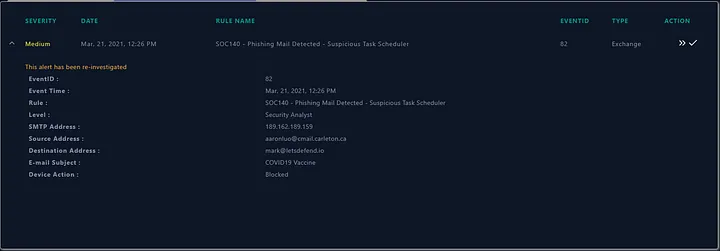
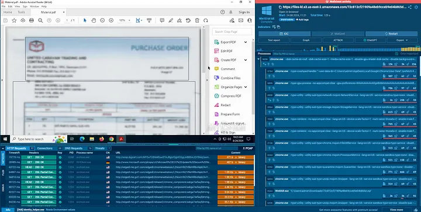

<h1 align="center">📧 SOC140 Incident Report</h1>
<h3 align="center">Event ID 82: Phishing Mail Detected – Suspicious Task Scheduler</h3>

---
  

  

## 📌 Incident Overview
<table>
<tr><td><b>Incident Name</b></td><td>EventID: 82 - [SOC140 - Phishing Mail Detected - Suspicious Task Scheduler]</td></tr>
<tr><td><b>Incident Type</b></td><td>Exchange (Phishing Attempt)</td></tr>
<tr><td><b>Rule Triggered</b></td><td>SOC140 - Phishing Mail Detected - Suspicious Task Scheduler</td></tr>
<tr><td><b>Created Date</b></td><td>September 11, 2025, 04:42 PM</td></tr>
<tr><td><b>Event Time</b></td><td>March 21, 2021, 12:26 PM</td></tr>
<tr><td><b>Severity Level</b></td><td>Medium</td></tr>
<tr><td><b>Device Action</b></td><td>Blocked ✅</td></tr>
</table>

---

## 📩 Email Details
- **SMTP Address:** `189.162.189.159`  
- **Sender:** `aaronluo@cmail.carleton.ca`  
- **Recipient:** `mark@letsdefend.io`  
- **Subject:** *COVID19 Vaccine*  
- **Content Suspicious:** Yes 🚩  
- **Attachment:** `72c812cf21909a48eb9cceb9e04b865d.pdf`  
- **Sandbox Result:** Malicious – attempted to create a **suspicious scheduled task**

  

  

---

## 🌐 Log Management (Extract)
<pre>
Type: Exchange
Source Address: 189.162.189.159
Source Port: 49371
Destination Address: 172.16.20.3
Destination Port: 25 (SMTP)
Time: March 21, 2021, 12:06 PM
Raw Log:
  Sender: aaronluo@cmail.carleton.ca
  Recipient: mark@letsdefend.io
</pre>

---

## 🔎 Analysis
- Phishing email impersonated **COVID-19 vaccine communication**.  
- Attachment (**PDF**) attempted persistence by creating a scheduled task.  
- SMTP source `189.162.189.159` is **untrusted & suspicious**.  
- SOC140 detection rule triggered due to **malicious task scheduler activity**.  
- Email successfully **blocked before reaching user inbox**.  

---

## 🛠 Mitigation & Response
- ✅ Blocked malicious email at the **email gateway**.  
- 🗂 Quarantined suspicious attachment.  
- 🔬 Sandbox confirmed malicious scheduled task creation attempt.  
- 🔎 Verified no further delivery attempts.  
- 📈 Added attachment hash to **threat detection systems**.  
- 👤 User `mark@letsdefend.io` notified & educated.  

---

## 📊 Impact Assessment
| Category | Assessment |
|----------|------------|
| **Compromise Status** | None – email blocked |
| **Business Impact** | Minimal |
| **Reputation Risk** | Low |

---

## ✅ Recommendations
- Continue monitoring **mail traffic** for similar phishing campaigns.  
- Block **sender IP/domain**: `189.162.189.159`, `cmail.carleton.ca`.  
- Strengthen **user awareness training** (COVID-themed lures).  
- Update **threat intel feeds** with discovered IOCs.  
- Run **retrospective searches** for additional attempts.  

---

## 📝 Conclusion
This was a **phishing attempt** leveraging a COVID-19 theme with a **malicious PDF attachment** designed to create persistence via a **scheduled task**.  
The organization’s **email security controls** effectively **blocked the threat** before delivery.  
No compromise detected.  

**Verdict:** True Positive  
**Impact:** None (prevented at gateway)  
